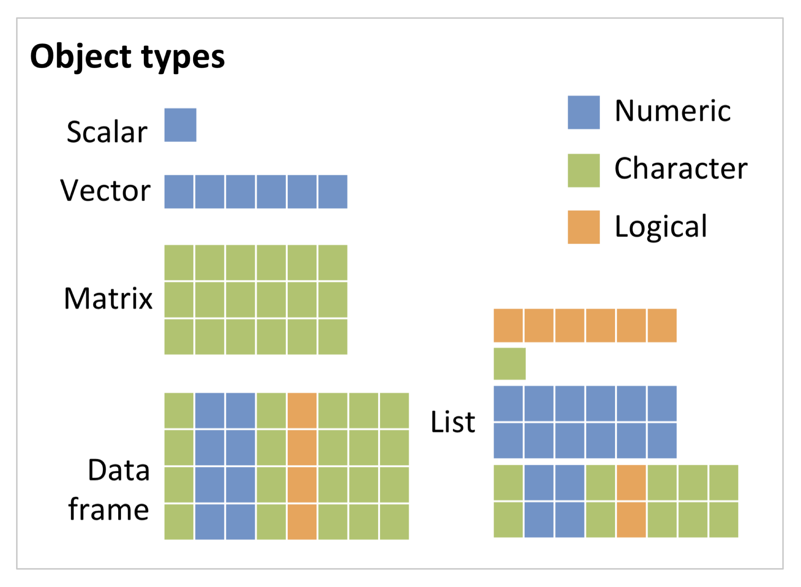

```{r setup, include=FALSE}
knitr::opts_chunk$set(echo = TRUE, fig.width = 4)
```

# Learning Objectives:

-   [x] Install R, Rstudio, and some R packages
-   Use the basic functions of R
-   Describe difference between RMarkdown, R scripts, and the console
-   Follow a project-based workflow for working in R
-   Identify 2 ways to get help

# Basic R use

This section will be hands on. It will cover

-   Basic things you can do in R
-   Basic definition of a function
-   How to save R code in a script
-   How to comment R code

You'll notice that there's some code in the following examples that we're not going to explain right away. We just want you to get a sense of what R can do here, you don't need to memorize everything.

# Start with some data

We're going to use the palmer penguins dataset for this vignette. Learn more here: <https://allisonhorst.github.io/palmerpenguins/>

```{r, warning = FALSE, message = FALSE}
# load the tidyverse package
library(tidyverse)
# load the palmer penguins package
library(palmerpenguins)
# load the penguins data
data(penguins)
```

We can also preview the data using the `head()` function. The data is saved in an object called a dataframe. A dataframe is a rectangular object with rows and columns.

```{r}
head(penguins)
```

*Important! If you haven't noticed yet, R is case-sensitive! upper vs. lower case matters. Generally, white space does not matter.*

In your RStudio environment window (top right pane), you should see a penguins line, that says there are 344 observations of 8 variables. You can click on the row in the environment pane to view the data. You can also run `View(penguins)` in your R console.

## R is a Calculator

R will do math operations using the same symbols as your old TI-83 (`+`, `-`, `*`, `/`, `^`, `()`).

```{r}
# basic addition
2+2
```

Remember PEMDAS?

```{r}
# PEMDAS
1+2*(2+2)^2
```

Applied example: what percentage of penguins are female?

Don't worry about the specifics of the code below. The key is that we're saving two numeric values so we can use them later. The total number of penguins that are female and the total number of penguins that are male.

```{r}
# save the total number of times the column sex holds the value female
# sum() is a function that counts up the total number of times this is true
female_penguins <- sum(penguins$sex == "female", na.rm = T)
# save the total number of times the column sex holds the value male
male_penguins <- sum(penguins$sex == "male", na.rm = T)

# print out the number of female penguins
female_penguins
```

```{r}
# the same math principles apply
female_penguins / (female_penguins + male_penguins)
```

### Question 1

**There are 3 species of penguins in the dataset (Adelie, Gentoo, & Chinstrap). The following code calculates the number of each.**

```{r}
# how many times is the column species equvalent to Adelie. 
adelie <- sum(penguins$species == "Adelie", na.rm = T)
# same for gentoo
gentoo <- sum(penguins$species == "Gentoo", na.rm = T)
# and for chinstrap
chinstrap <- sum(penguins$species == "Chinstrap", na.rm = T)
```

**What percentage are *not* Chinstrap?**

```{r}
# Type your code here:

```

```{r, class.source = "fold-hide", eval = FALSE}
(adelie + gentoo) / (adelie + gentoo + chinstrap)
```

## Boolean phrases

You might have noticed that we used `==` to indicate "is equal to" in some of the code above. R will return TRUE or FALSE to any boolean statement using a boolean operator (`==`, `!=`, `>`, `>=`, `|`, `&` )

We could just as well have calculated the sum of species that were not chinstrap to get the answer from above:

```{r}
not_chinstrap <- sum(penguins$species != "Chinstrap", na.rm = T)
not_chinstrap / (adelie + gentoo + chinstrap)
```

Or we could have calculated the total number of adelie and gentoo at the same time using `|` which is the or operator

```{r}
also_not_chinstrap <- sum(penguins$species == "Adelie" | penguins$species == "Gentoo", na.rm = T)
also_not_chinstrap / (adelie + gentoo + chinstrap)
```

### Question 2

**There is a column in the dataset called `bill_length_mm`. Use a boolean operater to calculate the number of birds whose bill length is greater than or equal to 42mm. Hint: The syntax for the code follows the same pattern as above, except we need to use the `bill_length_mm` column instead of the species column.**

```{r}
# Your code here
```

```{r, class.source = 'fold-hide', eval = FALSE}
more_than_40 <- sum(penguins$bill_length_mm >= 40, na.rm = TRUE)
more_than_40
```

## Assignment

By now, you've already used the `<-` assignment operator in R. This operator saves the result of a calculation as an object for later use. (Sometimes people will use `=` instead of `<-` and these are essentially the same thing. However, `=` and `<-` and `==` are NOT the same thing. `==` is the boolean operator for "is equivalent to".)

Generally speaking, it doesn't matter what you call something. The object's name has no predetermined relationship to the information in the object. If we change the object name to `less_than_40` but nothing else about the code, then the same result is saved.

```{r}
less_than_40 <- sum(penguins$bill_length_mm >= 40, na.rm = TRUE)
less_than_40
```

That said, it's usually good to name things intuitively. However, there are a few exceptions:

Exception 1: avoid using names that are already the name of functions.

```{r}
# Good name
sum_male <- 168
# Bad name
sum <- 50
```

Why is this a bad name? Because there's already a function called `sum()`. This mostly still works, but its confusing, and won't always work.

Exception 2: The only punctuation you should generally use is an underscore. Generally, we recommend using camelCase or snake_case for names that have more than one word.

```{r}
# camelCase
sumMale <- 168
# snake_case
sum_male <- 168
# 
```

## Data types

In the above sections, we used the numeric and logical data types.

There are a few other data types in R:

-   character (chr)

-   factor (fctr)

-   numeric (dbl)

-   integer (int)

-   logical (lgl).

We can see what data types are in our penguins dataframe using the `glimpse()` command.

```{r}
glimpse(penguins)
```

We can create character data using quotations

```{r}
favorite_color <- "blue, no green"
favorite_color
```

Booleans using `TRUE` or `FALSE` (Note that in RStudio, `TRUE` and `FALSE` are highlighted).

```{r}
is_this_true <- TRUE
is_this_true
```

## Object types

So far, we've seen three of the main object types in R. A dataframe, a scalar (a single value), and a vector.

```{r, out.width = "500px", echo = FALSE}
 
```

A vector holds a series of values of the same kind. We've already used vectors above. The `$` operator extracts columns from dataframes. Extracting a single column results in a 1-dimensional series, or a vector

```{r}
# print the first 10 elements of the vector 
penguins$species[1:10]
```

One way of creating a vector is using the `c()` function. c stands for "concatenate".

```{r}
ratings <- c("unlikely", "somewhat unlikely", "somewhat likely", "likely")
ratings
```

Lists are objects that can hold different types of objects within. A list can hold one or more scalars, vectors, and/or dataframes. We won't touch much on lists this workshop.

# Functions

You might have noticed that we started using a few built-in R functions in the last section (e.g., `sum()`, `class()`, `c()`, `as.numeric()`), Functions perform specific operations. They are structured like this:

`name_of_function(argument_1, argument_2, etc...)`

You can see what arguments a function has by typing `?name_of_function()` in the console.

Try looking up the `sum()` function to see what it's arguments are.

###Question 3

**Pair the `sum()` function is the `is.na()` function to count up how many missing values there are in the entire penguins dataframe. use `?is.na()` and `?sum()` or do some googling to see if you can find the answer.**

```{r}
# Type your code here:

```

```{r, class.source = 'fold-hide', eval = FALSE}
sum(is.na(penguins))
```

### Question 4

**What about the number of `NA` (missing) values in the `body_mass_g` column?**

```{r}
# Type your code here: 

```

```{r, class.source = 'fold-hide', eval = FALSE}
sum(is.na(penguins$body_mass_g))
```

# A project workflow from start to end

Install the here package

```{r, eval = FALSE}
install.packages("here")
```

Everything we do in this workshop will be contained in an "R Project". Projects are a way to group all of the files you need for one project. Most projects include scripts, data files, and output files like the PDF report created by the script or images.

We're going to make a project for this workshop.

Go to File --\> choose New Project --\> choose new Directory and save the project in a location that makes sense for you on your computer (perhaps Documents/r-projects/pitt-csd-r-workshop). Rstudio will now open the project. Any files in your project (there should only be a blue project file right now) will be in the files pane on the botton right of Rstudio.

Where should you put all of your files? You usually want to have all of your scripts and data files for a single project inside one folder on your computer, the working directory for that project (a working directory is the filepath where R is currently reading and writing files). You can organize files in sub-directories inside this main project directory, such as putting all raw data files in a directory called data and saving any image files to a directory called images.

You can verify the working directory using the `getwd()` command in the console. If you've opened your Rproject, it will default to the root folder *for the r project*. If you forgot to open the Rproject, `getwd()` will refer to some other folder, and your scripts will have a hard time finding your files.

*Though its not always followed, best practice is to use R-projects for any analyses instead of setting the working directory manually in each script*.

Lets make a few folders in this directory: - data - images - R

How would we access data in these folders? We can use the {here} package we installed earlier. The `here()` function will tell you where the current working directory is as well.

```{r}
library(here)
here()
```

If you wanted to access a folder, we can add the folder name to `here()`:

```{r}
here("R-not-scary")
```

And we can access a file in the data folder:

```{r}
here("R-not-scary", "compound_words.csv")
```

The palmer penguins data comes pre-packaged for use in R. But our data is usually saved in files like .csv files. Save the compound_words.csv file in your data folder, and we can read it into R.

```{r}
# df is a common abbreviation used for dataframe
df = read.csv(here("01-intro-to-R", "compound_words.csv"))
```

# RMarkdown (.Rmd) vs. R Scripts (.R)

When you're saving an R code in a document, you have two main options.

(1) You can save your code in an R Script (.R), which is a text file with R code, and comments, which can be marked using the `#` symbol in front of any text. Comments are notes to yourself or others that aren't run as code.

(2) You can save your code in an RMarkdown document (.Rmd), which combines the features of a markdown document and an R script. This allows you to write text easily, with most formatting features (e.g., bold, italics, headers, links, images etc.) you're used to in Microsoft Word/ Google docs, but also include R code in "chunks." This document is an Rmarkdown document. You can still comment your code using `#` inside each code chunk, but you can also easily write nicely formatted text. For the rest of this workshop, we're going to demonstrate and encourage you to use RMarkdown documents instead of scripts (though sometimes scripts can be helpful to quickly test out code!).

# Appendix

## List of operators and other helpful functions

There are several base R operators that may come in handy to list here, and one in particular that is essential when transforming, tidying, and wrangling data. We will use several of the following operators in our practice exercises and in the hands on lab work. The following are for reference as you go throughout the course. We won't go through everything right away.

-   `<-` : assign to if you want to take some vector, string, plot, or other item and save it for future use.

*you can also use `=` interchangeable. There are some very very minor historical differences that are largely ignorable.*

-   `<` and `>` : less than and greater than.
-   `<=` and `>=` : less than or equal to and greater than or equal to
-   `==` : is exactly equal to
-   `!=` : is not equal to (! means "not")
-   `&` : and
-   `|` : or
-   `!` : not
-   `c()` : combine/concatenate - when we want to use multiple numbers
-   `:` : through - for example 1:10 means 1,2,3,4,5,6,7,8,9,10.
-   `[ ]` : used for indexing into vector, matrix, array, list, or data frame.
-   `#` : comment out; you can write code and keep it without having it run by adding a hash tag before the line.

## Helpful base R functions in general

-   `head()` previews the top 6 rows of a dataframe
-   `summary()` provides descriptive statistics for a dataframe or variable
-   `unique()` returns all the unique values in a vector
-   `length()` returns the length of an object
-   `nrow()` returns the number of rows in a dataframe
-   `seq()` returns a sequence of numbers
-   `rep()` returns a repeated sequence
-   `paste()` paste's together or collapses a character vector

## Helpful base R functions for statistics

-   `mean()`
-   `median()`
-   `sum()`
-   `range()`
-   `min()`
-   `max()`

If you want to review some of the things reviewed in this section, there are some youtube videos posted below:

Using the R Console: <https://www.youtube.com/watch?v=wbI4c_7y0kE>

Understanding coding terms and functions: <https://www.youtube.com/watch?v=X5P038N5Q8I&feature=youtu.be>

Operators, and such: <https://psyteachr.github.io/reprores-v2/intro.html#console>

### Suggestions on naming things:

Name files so that both people and computers can easily find things. Here are some important principles:

-   file and directory names should only contain letters, numbers, dashes, and underscores, with a period (.) between the file name and extension
-   NO SPACES!
-   be consistent with capitalisation (set a rule to make it easy to remember, like always use lowercase)
-   use underscores (\_) to separate parts of the file name, and dashes (-) to separate words in a section
-   name files with a pattern that alphabetises in a sensible order and makes it easy for you to find the file you're looking for
-   prefix a filename with an underscore to move it to the top of the list, or prefix all files with numbers to control their order

For example, these file names are a mess:

-   report.doc
-   report final.doc
-   Data (Customers) 11-15.xls
-   Customers Data Nov 12.xls
-   final report2.doc
-   project notes.txt
-   Vendor Data November 15.xls

These are better:

-   \_project-notes.txt
-   report_v1.doc
-   report_v2.doc
-   report_v3.doc
-   data_customer_2021-11-12.xls
-   data_customer_2021-11-15.xls
-   2019-11-15_vendor-data.xls

## Getting help

You will feel like you need a *lot* of help when you're starting to learn. This won't really go away, and it isn't supposed to. Experienced coders are also constantly looking things up; it's impossible to memorise everything. The goal is to learn enough about the structure of R that you can look things up quickly. This is why there is so much specialised jargon in coding; it's easier to google "adding [vectors](https://psyteachr.github.io/glossary/v#vector "A type of data structure that collects values with the same data type, like T/F values, numbers, or strings.") in R" than "adding lists of things that are the same kind of data in R".

### Function Help

If a function is in [base R](https://psyteachr.github.io/glossary/b#base-r "The set of R functions that come with a basic installation of R, before you add external packages") or a loaded [package](https://psyteachr.github.io/glossary/p#package "A group of R functions."), you write `?function_name` in the console. If the package isn't in base R, load it first using `library(package_name)`, and then you can write `?functoin_name`.

```{r eval = FALSE}
# these methods are all equivalent ways of getting help
?rnorm
help("rnorm")
help("rnorm", package="stats") 
```

When the package isn't loaded or you aren't sure what package the function is in, use the shortcut `??function_name`.

-   What is the first argument to the `mean` function? trim na.rm mean x

-   What package is `read_excel` in? readr readxl base stats

### Googling

If the function help doesn't help, or you're not even sure what function you need, try Googling your question. It will take some practice to be able to use the right jargon in your search terms to get what you want. It helps to put "R" or "rstats", or "tidyverse" in the search text, or the name of the relevant package, like **`ggplot2`**.

# Final Questions

### Question 5

List a few things you're not sure about:

# Session Info

```{r}
sessioninfo::session_info(pkgs = "attached")
```
