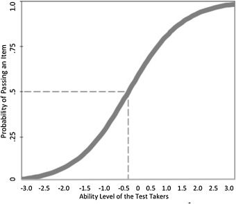
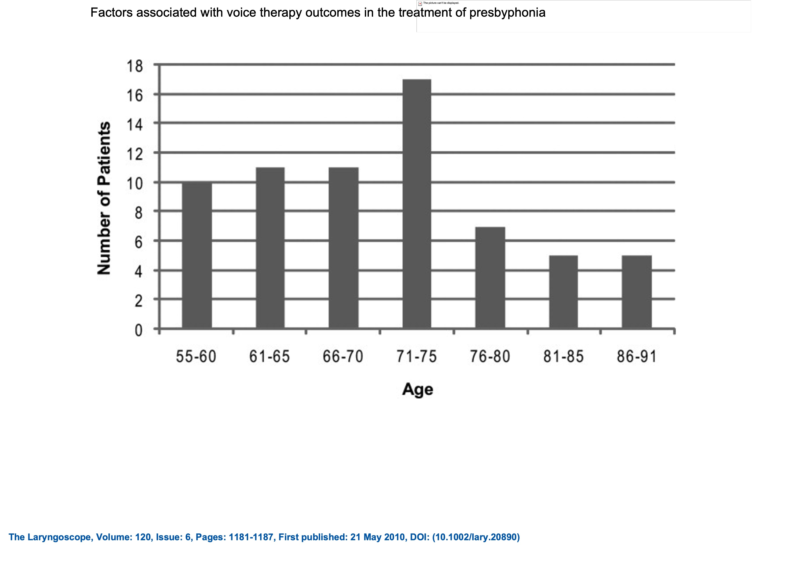
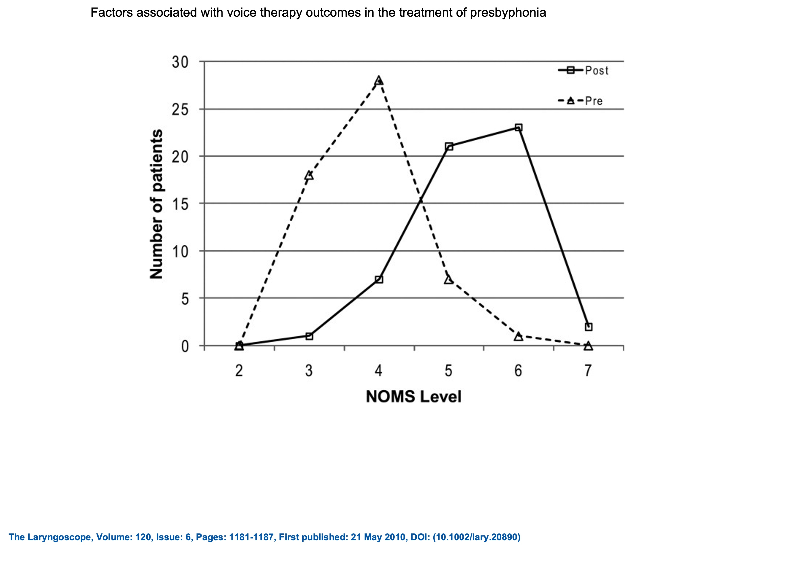

## Before getting started make sure to load the following libraries:
  -ggplot2
  -readr
```{r}  
#load libraries here:
library(ggplot2)
library(readr)
```
## Excercis 1:


Reproducing figure 1 from Tucci et al., 2019
(Reading the abstract is not necessary to complete excercise 1)
### Abstract
The first stage of test development is the generation of a pool of potential items to be used in the assessment. Ideally, these items are then tested in the field on members of the population for which the assessment is intended. This initial analysis assures that tests build in validity at the level of the individual items.

#### Method
Seventy-four potential test items developed for the Shirts and Shoes Test (Plante & Vance, 2012) were tested on 513 children between the ages of 3 and 6 years. An Item Response Theory (IRT) approach was used to identify potential items in the item pool which are unsuitable due to one or more types of deviation from the IRT model. Furthermore, an IRT approach provides data that permits the ordering of items by difficulty.

#### Results
A total of 19 items were discarded due to noteworthy deviations in one or more of the measures related to item response characteristics. The remaining 55 items reflected a range of skill difficulty and were deemed suitable for an age range of 3- to 6-years.

#### Conclusions
Item Response Theory can be used productively to identify items that fail to add to the reliability and validity of a test during the earliest stages of test development. The number of items culled for this test demonstrates that the content of the items alone does not assure that the items perform in ways that promote accurate skill measurement.

#### Getting started:
In this excercise you will rely on previously learned tools and two new tools within the ggplot library.  Your goal is replicate the following figure as close as possible. 



###### To complete this task, first load the following dataset: "tucci.csv"
  - don't forget to name your dataframe someting easy to remember
```{r}
#load data set here:
df =read.csv("tucci.csv")

```

##### Next, use ggplot to approximate Figure 1. You will need to investigate how to add the horizontal and vertical bars. 
  - Some of this is new, but some is not! Don't forget to utilize resources (code) you have already written to make this process easier. 
  - Use google to search for how to change the width of of your line: record the searches that yield an answer and that that did not. 
  - Use google to search for how to add horizontal and vertical lines: record the google searches that yielded an answer and those that did not.  
  - Do not forget to use keywords in your google search such as R, ggplot, and etc. 
  - For the sake of not trying to get too exact, place your vertical line on x = 0 and your horizontal line on y = 0.5.

```{r}
ggplot(df, aes(x = ability, y = prob_c)) +
  geom_smooth(size = 1.5, color = "grey") +
  geom_segment(aes(x = 0, xend = 0, y = 0, yend = 0.50), color = "grey", linetype = "dashed") + 
  geom_segment(aes(x = -3, xend = 0, y = 0.5, yend = 0.50), color = "grey", linetype = "dashed") +
  labs(title = "Figure 1",
       x = "Ability Level of the Test Taker",
       y = "Probability of Correct Response")
```
## Excercise 2: In their 2010 paper, Factors associated with voice therapy outcomes in the treatment of presbyphonia, Mau, Jacobson, and Garrett produce a figure comparing national outcome measures (NOMs) to the number of patients before and after voice therapy. Replicate both Figure 1 using the "mau_age.csv" and Figure 2 with "mau_tx.csv" datasets.

### Figure 1: Mau et al., 2010

### Load data for figure 1
```{r}
mau1 = read_csv("mau_age.csv")
```

### Generate a summary of the age variable
```{r}
summary(mau1)
```

### Replicate Figure 1:
 - Add an informative title
 - Label axes appropriately
 - Add the number of participants and mean age in a subtitle.
 - Modify axes tics to match the original Mau et al figure
 - hints:
  - try geom_bar() if geom_histom() does not work for you.
  - look at the various variables in the data set
  - Changing the y axis label ticks is not incredibly easy to find. navigate to https://ggplot2.tidyverse.org/reference/scale_continuous.html for help.
 
```{r}
ggplot(mau1, aes(x = age_range)) +
  geom_bar() +
  scale_y_continuous(n.breaks = 10) +
  #scale_x_discrete(c("55-60", "61-65", "66-70", "71-75", "76-80", "81-85", "86-91")) +
  labs(title = "Figure 1: Distribution of age of study participants",
       subtitle = "n = 66, mean = 70.61",
       x = "Age in years",
       y = "Number of patients")
```

### Replicate Figure 2: 
 - Add an informative title
 - Label axes appropriately
 - Modify axes tics to match the original Mau et al figure
 - Insure the the plot points and lines are differentiated by either color, shape, line style or both.
 - hints:
  - Think about the number of geoms required to create the plot


#### Load data:
- hint: don't forget to name it!

```{r}
mau2 = read_csv("mau_tx.csv")
```

#### Generate the plot
```{r}
ggplot(data = mau2, aes(x = noms, y = num_patients)) +
  geom_point(aes(color = tx, shape = tx)) +
  geom_line(aes(color = tx, linetype = tx)) + 
  labs(title = "Figure 2: NOMs change over time Pre and post treatment)",
       subtitle = "n = 66, mean = 70.61",
       x = "Number of patients",
       y = "NOMS level")
```
