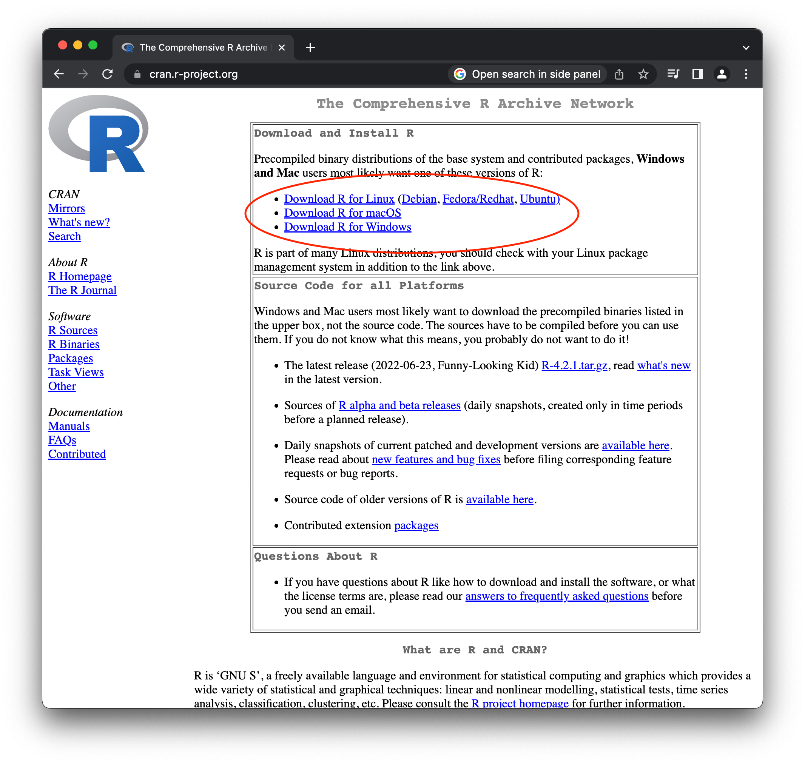
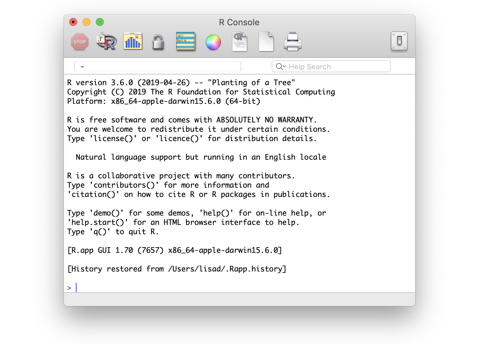
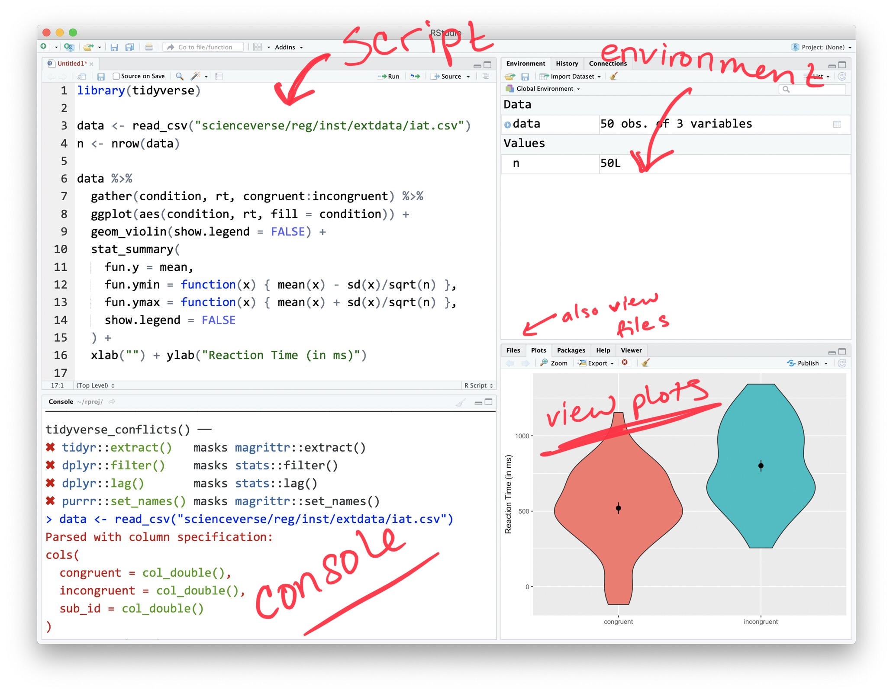
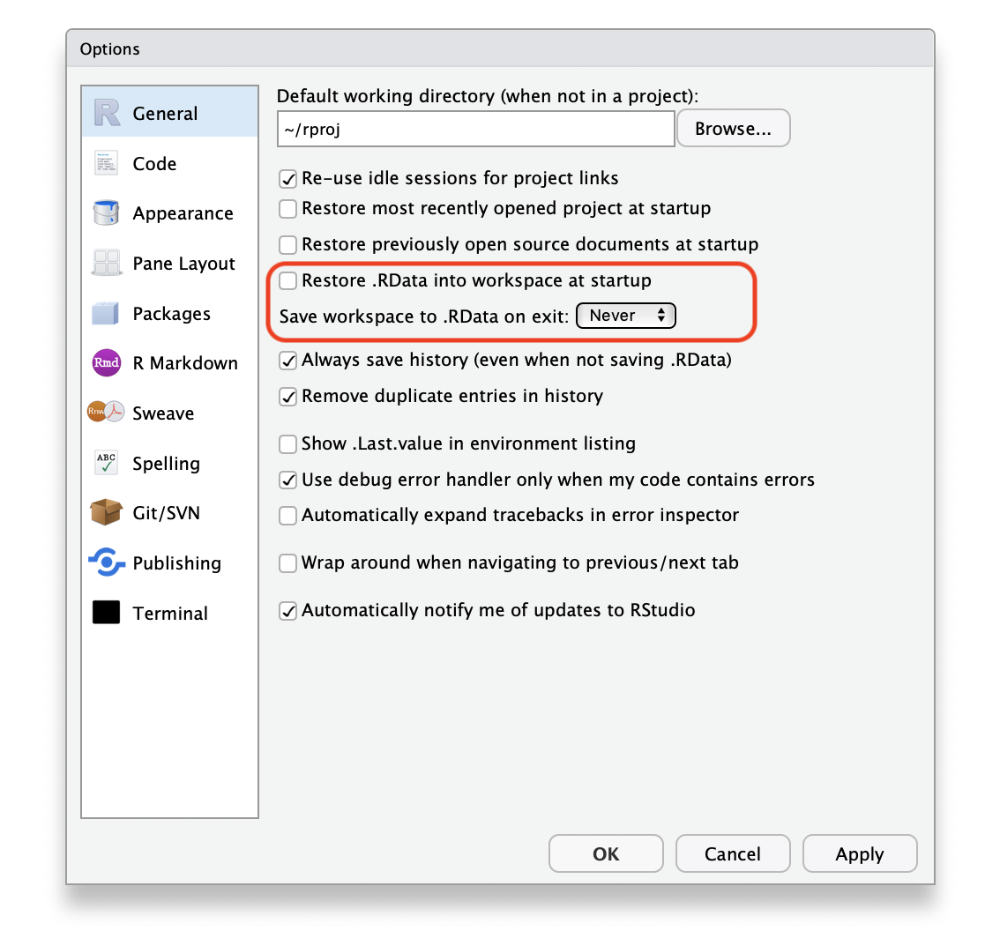

Introduction to R - 2022 Pitt CSD Workshop
================

# Pre-workshop to do list:

1.  Install R  
2.  Install Rstudio  
3.  Install some R packages

*More detailed instructions for installation can be found here:
<https://rstudio-education.github.io/hopr/starting.html>*

*If you prefer not to install R and Rstudio locally (or have difficulty
doing so), please create a free account with Rstudio cloud here:
<https://rstudio.cloud>. Then skip to step 3 and install the few needed
packages*

# What is R, and why use it?

R is a *free* programming environment for data processing and
statistical analysis. R allows you to write scripts that combine data
files, clean data, and run analyses. R is really useful for conducting
reproducible research (research that documents all of the steps between
raw data and results in a way that can be verified), automating
analytical steps, creating custom high-quality visualizations, and
conducting a wide range of statistical analyses from basic t-tests to
multivariate multilevel Bayesian regression.

This document details steps to get started in R as part of the R for
researchers in Communication Sciences and Disorders workshop (August
2022). It synthesizes already-published materials for teaching R in a
way that is tailored to this workshop. Anyone interested in the full
materials can find them here: <https://psyteachr.github.io/>.

# Install R

[Install base R](https://cran.rstudio.com/). This installs the R
programming language and a simple GUI (from here on, we will refer to it
as the R GUI). Choose the download link for your operating system
(Linux, Mac OS X, or Windows).

<figure>

<figcaption aria-hidden="true">Download page for R and the R
GUI</figcaption>
</figure>

If you have a **Mac**, install the latest release from the newest
`R-x.x.x.pkg` link (or a legacy version if you have an older operating
system). After you install R, you should also install
[XQuartz](http://xquartz.macosforge.org/) to be able to use some
visualisation packages. (Note, you may need to right click and open the link in a new tab). 

If you are installing the **Windows** version, choose the
“[base](https://cran.rstudio.com/bin/windows/base/)” subdirectory and
click on the download link at the top of the page. After you install R,
you should also install
[RTools](https://cran.rstudio.com/bin/windows/Rtools/); use the
“recommended” version highlighted near the top of the list.

If you are using **Linux**, choose your specific operating system and
follow the installation instructions.

If you have trouble with installation, R can also be used online:
[RStudio Cloud](https://rstudio.cloud/) is a free online service that
allows access to R and RStudio. If you decide to use the cloud version, you can skip installing RStudio on your computer.



# Install RStudio

RStudio is an “IDE” (Integrated Development Environment) for using R
(and some other languages). RStudio allows us to run R code and comes
with lots of other features that makes using R easier and more
efficient.

Go to
[rstudio.com](https://www.rstudio.com/products/rstudio/download/#download)
and download the RStudio Desktop (Open Source License) version for your
operating system under the list titled **Installers for Supported
Platforms**.

On mac, when you open the installer package, it will open a window with the applications folder and the
Rstudio app. Drag the Rstudio logo into the applications folder. After this, you can
move the installer package to your trash. 

If you’re unsure about where something is in RStudio, try finding it in
the cheat sheet here:
<https://raw.githubusercontent.com/rstudio/cheatsheets/main/rstudio-ide.pdf>



There are a few settings you should fix immediately after updating
RStudio. Go to **`Global Options...`** under the **`Tools`** menu (⌘,),
and in the General tab, uncheck the box that says
**`Restore .RData into workspace at startup`**. If you keep things
around in your workspace, things will get messy, and unexpected things
will happen. You should always start with a clear workspace. This also
means that you never want to save your workspace when you exit, so set
this to **`Never`**. The only thing you want to save are your scripts.



*If you’re having trouble finding this setting, make a note to yourself
and let us know when we get started on day 1*

# Install Packages

“base R” (everything that comes with the initial installation of R)
comes with many basic functions for data wrangling, plotting, and
statistical analysis, but most people (including us, and this workshop)
use additional packages that add additional features to R.

The main repository where packages reside is called
[CRAN](https://psyteachr.github.io/glossary/c#cran "The Comprehensive R Archive Network: a network of ftp and web servers around the world that store identical, up-to-date, versions of code and documentation for R."),
the Comprehensive R Archive Network. A package has to pass strict tests
devised by the R core team to be allowed to be part of the CRAN archive.
You can install from the CRAN archive with the
[`install.packages`](https://rdrr.io/r/utils/install.packages.html)`()`
function. Try installing the following packages:

``` r
# installs the package tidyverse, which includes data wrangling and viz tools
install.packages("tidyverse")
# installs the package here, which helps with file management
install.packages("here")
# install the usethis package, which has lots of useful functions
install.packages("usethis")
```

Sometimes, installing packages can result in errors. If you run into an
error, copy and paste the error into a sticky/note on your computer and
save it for the beginning of the workshop.

*Note: Never install packages within a script, only install scripts from
the console*

# Installing LaTeX (optional)

You can install the LaTeX typesetting system to produce PDF reports from
RStudio. To generate PDF reports, you will additionally need to install
**`tinytex`** ([Xie,
2022](https://psyteachr.github.io/reprores-v2/bookrefs.html#ref-R-tinytex))
package and run the following code:

``` r
install.packages("tinytex")
tinytex::install_tinytex()
```

# Troubleshooting

Occasionally, you might have a few problem packages that don’t install
or update cleanly. If you try to update a package and get an error
message that says something like *Warning in install.packages :
installation of package ‘vctrs’ had non-zero exit status* or perhaps
*Error in loadNamespace(i, c(lib.loc, .libPaths()), versionCheck =
vI\[\[i\]\]) : namespace ‘rlang’ 0.4.9 is being loaded, but \>= 0.4.10
is required*. One solution I have found is to manually uninstall the
package, restart R, and then install the package new, rather than trying
to update an existing version.

``` r
# Uninstall the problem package
remove.packages("package_name")

# Then restart R. Choose session from the top menu and then restart R

# Then install the package fresh
install.packages("package")
```
