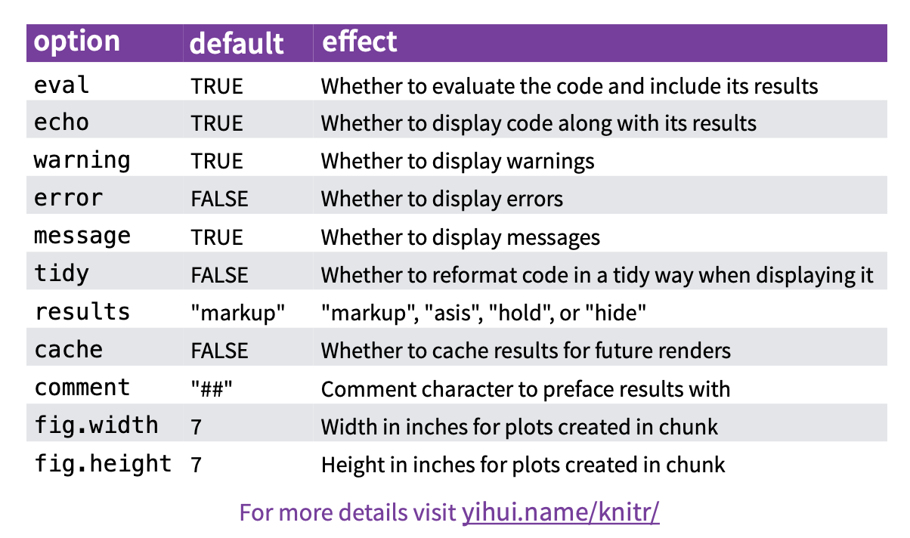

```{r setup, include=FALSE}
knitr::opts_chunk$set(echo = TRUE)
```

# Purpose

We've already been using RMarkdown for the previous modules in this
workshop. The purpose of this module is to review the basics of
RMarkdown and answer any questions you have about Rmarkdown documents.

The exercise will ask you to combine skills in data wrangling (part 1)
and visualization (part 2) to put together a fully reproducible document
that can be shared with collaborators.

## Why R-markdown?

-   Reproducible reports provide a way to conduct and share your entire
    analysis - reading in raw data, data wrangling, creating tables,
    figures, and text - without modifying your data. This makes your
    research pipeline transparent.

-   They can be easily read or reproduced by someone else in your lab to
    check your methods or external reviewers or consumers of your
    research. Sharing an Rmarkdown document or report is also a great
    way to get help in an analysis.

-   Even if you can't share your data, you can share your report with
    your code, which helps reviewers understand what you've done in your
    methods and statistical analysis.

-   If you identify an error or need to change something (e.g., you find
    out that a participant did not qualify for your study after the
    fact...perhaps you find out they were diagnosed with an exclusionary
    condition), you can modify and re-run your script instead of
    re-doing many manual steps.

Some examples of reproducible report from our lab: (you can look at the
Rmarkdown documents or .html files).

-   <https://osf.io/dxvyj/>
-   <https://osf.io/sfutm/>

## Resources

This module will just include the basics, but there is a lot more to
Rmarkdown.

See here: <https://bookdown.org/yihui/rmarkdown-cookbook/> and here:
<http://rmarkdown.rstudio.com>

A helpful cheat sheet can be found at
<https://www.rstudio.com/wp-content/uploads/2015/02/rmarkdown-cheatsheet.pdf>
and in this folder.

We'll review the basics today, but the best way to learn RMarkdown is
just to start using it for your own projects. Trying to memorize the
formatting is probably not a good use of time. Don't worry if you don't
retain everything from today - the goal is just to get you started.

## About of R Markdown

### Basic features

There are a couple of features of R-markdown that are important to know

-   objects are encapsulated to the document - it won't use any objects
    or functions already loaded into your environment
-   content inside the R "chunks" will be run as scripted R.
-   content outside the R "chunks" will be compiled as markdown.
-   R code can be run "inline" using this syntax in markdown: \`r
    some_R\_code()\`

### Code chunk options

Each code chunk has a number of options related to how to display the
code, results, warnings, and messages - WARNING, MESSAGE, ECHO, EVAL,
INCLUDE etc. and fig.width out.width etc.

{width="800"}

### YAML

The \-\-- section above is called the "YAML" header, and contains
information about the document and information that helps to compile the
document. This is where you can include the title, author list, and
date. It's also where you should specify the type of document you'd like
to create: an html_document, word_document, or pdf_document. Note that
for PDF documents, you need to have latex installed
(<https://yihui.org/tinytex/>).

Some common YAML options include:

-   title:

-   author:

-   affiliation

-   date:

-   output:

-   description:

More details on options can be found here:

-   <https://bookdown.org/yihui/rmarkdown-cookbook/multiple-authors.html>

-   <https://bookdown.org/yihui/rmarkdown/html-document.html>

### Markdown basics

-   #, ##, ###, & \#### are headers. so "\# Purpose" will place
    "Purpose" as a level 1 header in the document
-   \* \*\*, and \*\*\* are bold, italic, and bold-italic
-   \> will create an indented block quote
-   The Rmarkdown cheatsheet is a great reference for formatting options

### More advanced markdown

-   markdown can also incorporate citations, math notation/formulas, and
    raw latex code

### Additional notes

-   You can run chunks without running the entire document (small green
    triangle in a chunk)

-   Knit to run the entire document.

-   Rmarkdown has a visual editor that is slightly more like word (see
    source vs. visual in top left)
